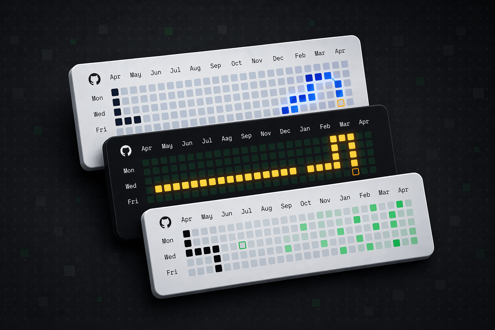
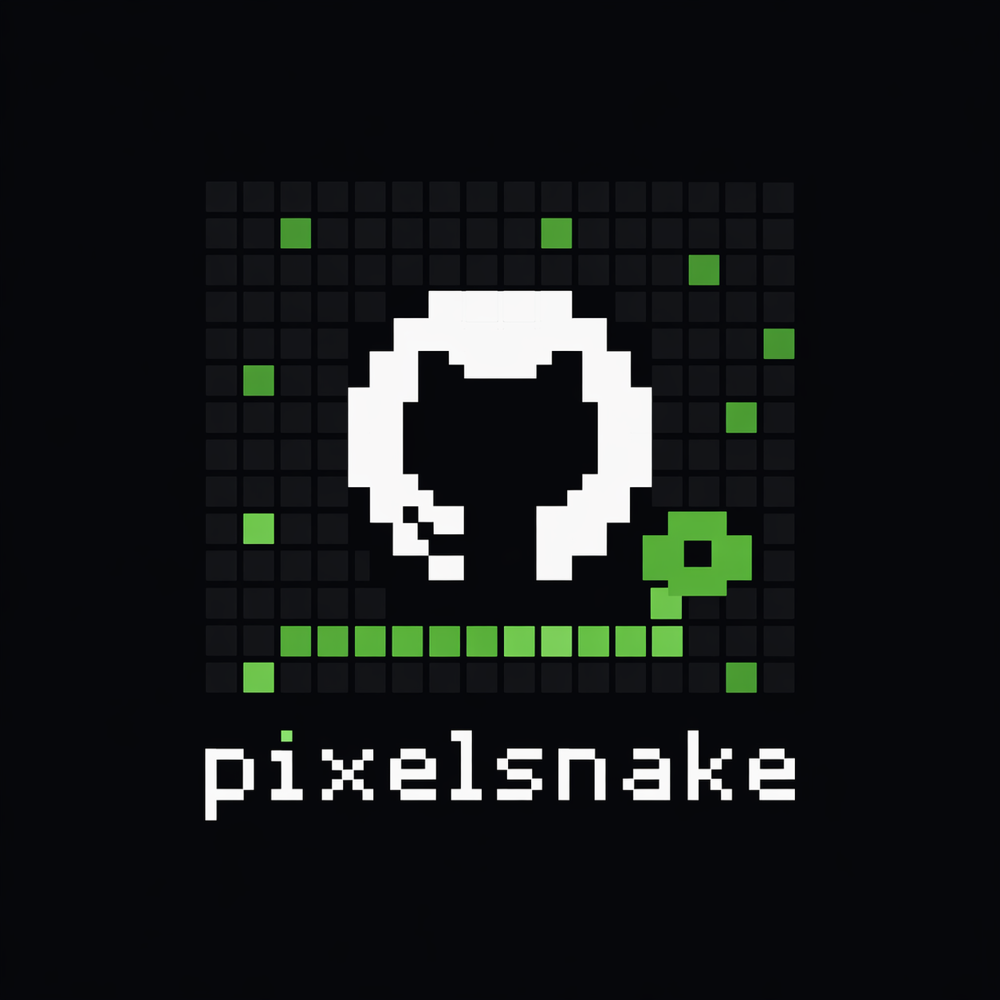

# pixelsnake

<p align="center">
  
</p>

A playable snake game built on your GitHub contribution graph. Click any cell to start — arrows or WASD to steer, retro chip audio, ripple animation on game over.

**[Live demo →](https://kishore.design)** (scroll to the footer)

---
<p align="left">
  
</p>


## Add to your existing site

Pixelsnake is a React component you drop into your existing Next.js project. No separate deployment, no iframe.

### 1. Copy the files

Copy these two files into your project:

```
src/components/contribution-snake.tsx  →  your component
src/lib/github-contributions.ts        →  your data fetching util
```

Also merge the snake CSS from `src/app/globals.css` — everything from the `/* ─── Snake / contribution grid ───── */` section down.

### 2. Fetch data server-side

In a Server Component (e.g. your page or layout):

```tsx
import { ContributionSnake } from "@/components/contribution-snake";
import { getGithubContributions } from "@/lib/github-contributions";

const data = await getGithubContributions("yourusername");

return <ContributionSnake data={data} />;
```

Data is fetched server-side and revalidates every hour — no client-side API calls, no rate limit issues.

### 3. Done

The widget is fully self-contained. No environment variables required for basic use.

---

## How to play

Click any cell on the contribution grid to start. The snake spawns at that cell.

| Control | Action |
|---------|--------|
| `↑ ↓ ← →` or `W A S D` | Steer |
| `ESC` | Pause |
| Click any cell | Start / restart |
| Swipe | Steer on mobile |

---

## Customization

### Speed

Open `contribution-snake.tsx` and change the constant at the top:

```ts
const TICK_MS = 120; // lower = faster
```

### Colors

All colors are CSS custom properties. The `:root` block is light mode, `[data-theme="dark"]` is dark mode.

| Variable | What it controls |
|----------|-----------------|
| `--color-contrib-0` → `5` | Contribution cell shades (idle) |
| `--color-contrib-active-0` → `5` | Contribution cell shades (while playing) |
| `--color-snake` | Snake body |
| `--color-snake-food` | Food cell |
| `--color-snake-active` | Snake body while playing |
| `--color-snake-food-active` | Food while playing |
| `--color-danger-wave` | Game-over wave color |
| `--color-danger-text` | "Game over" text |

### Cell size

Cell size auto-fits available width. To force a fixed size:

```css
.contribution-map {
  --contribution-cell-size: 12px;
}
```

---

## Tech

React · Next.js · TypeScript · Tailwind CSS v4
